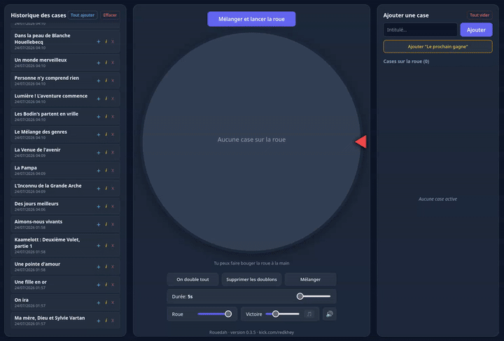

## Rouedah
- version en beta : **0.11.1**
- code source : [index.html](index.html)
- tester directement : [par ici](https://rouedah.flens.dev/)

## Rouedah
Faire tourner une roue pour laisser le destin choisir.
À la base, c'est pour choisir un film, d'où la liste historique pour remttre les films non vu dans la roue la prochaine fois.
Idée incité et amélioré par Redkhey.

## Comment ça marche ?
Un fichier index.html qui fait TOUT et stock toutes les données dans le navigateur. Si vous changer de profil, de pc ou en navigation privée, les données ne sont pas synchronisées.

Il y a un son pour la victoire (victory-zelda-fix.mp3) non obligatoire.

## Le code est exclusivement généré par IA
Ce projet reste du code 100% IA, à vos risques et périls !

## Visuel
- Visuel de la version 0.3.5

